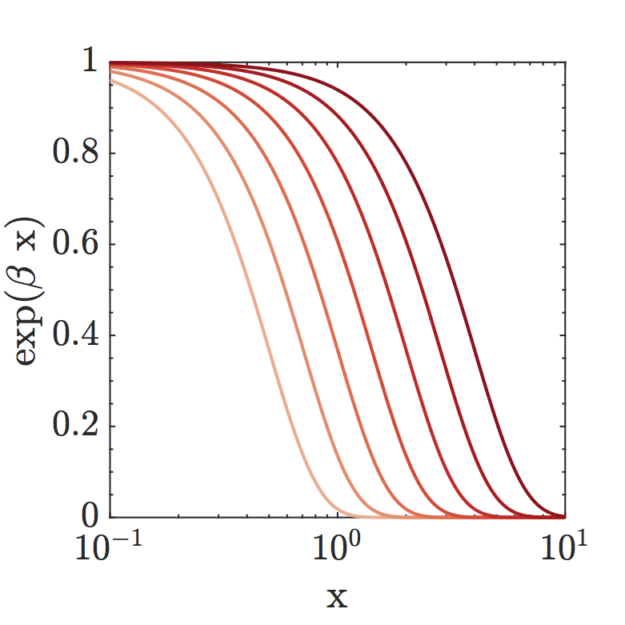
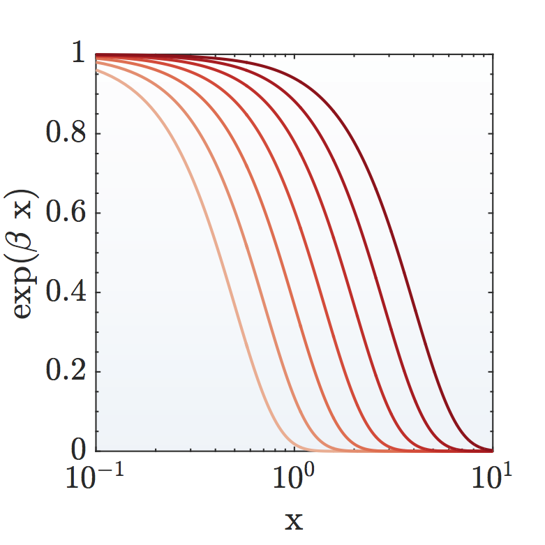

# AddGradient
A Matlab function to add a gradient image to a figure background, the image is fit to the current axis handle of the provided figure handle. This function was motivated because our research group commonly creates figures with colored backgrounds in powerpoint post generation of the figure in Matlab.  This function helps make the figures more reproducible for publication.

Has been tested on linear and log scale images, double axis images, subplots, and most other simply matlab figures.

### Developers
Nathan Walter, UIUC, walternathan6754@gmail.com

### Test Environments
Matlab 2015b, Mac OS X 10.11

### src
##### Files
* **addGradient.m**
    function to add a gradient image to a figure background

    ##### Inputs
    * 'currentFigure' -- handle to figure to add gradient
    * 'rangeLow'      -- integer 0 to 256 indicating the lighter color
    * 'rangeHigh'     -- integer 0 to 256 indicating the darker color
    * 'colormap'      -- string indicating the colormap to generate gradient from (and default matlab color map or 'reds', 'blues', 'greens', 'purples')
    * 'alpha'         -- float 0 to 1 indicating the alpha channel of the gradient
    * 'inverse'       -- boolean indicating if gradient is up-down or down-up orientated
    * 'auto'          -- boolean indicating if the figure has 'auto' scaled axis
* **resizeGradient.m**
    function to resize an already added gradient if it does not fit current axis. This can occur when a figure size is changed post gradient addition
* **colors.mat**
    Matlab matrix with various color gradients included

### Example
The command to add a colored gradient to the following image

`>> addGradient(gcf, 'rangeLow', 0, 'rangeHigh',100,'colormap', 'blues', 'alpha', .1, 'inverse', 1);`

This command adds a red tinted gradient to the figure, as shown below

This function is commonly used in our group for finalizing images for publication
